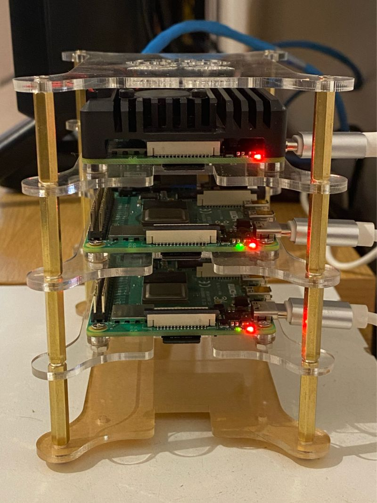
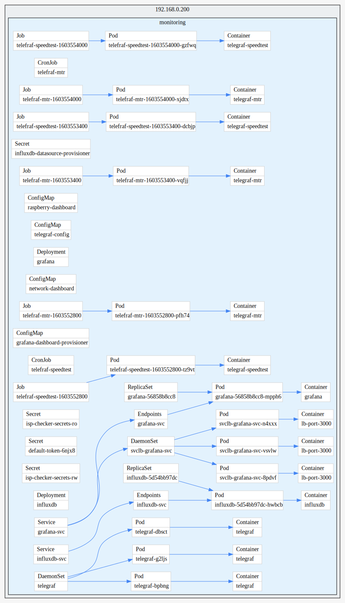

# ISP-Checker on Kubernetes


`ISP-Checker` was ported to run in Kubernetes (`1.18.0`) in a ***Raspberry Pi 4*** cluster (_It's all I have_). For that I've installed [K3s](https://k3s.io).

<div align="center">
<kbd>

</kbd>
</div>


The following `YAML` configuration files are used to deploy this stack in Kubernetes by creating the basic objects to run.
They can widely improved but so far let's say it works. :)

> ***NOTE***: The Kubernetes deployment is in *BETA* version. Don't worry if you see something wrong here.

## Installing, the quick way:

1) Apply the `ISP-Checker-deploy.yaml`
```bash
$: kubectl apply -f https://raw.githubusercontent.com/fmdlc/ISP-Checker/master/kubernetes/ISP-Checker-deploy.yaml
```
---

### Configuration

> Edit `secrets.yaml` in order to initialize your InfluxDB database.
```yaml
---
apiVersion: v1
kind: Secret
metadata:
  namespace: monitoring
  name: isp-checker-secrets-rw
type: Opaque
stringData:
  INFLUXDB_DB: telegraf
  INFLUXDB_ADMIN_USER: admin
  INFLUXDB_ADMIN_PASSWORD: VerySecurePassword

---
apiVersion: v1
kind: Secret
metadata:
  namespace: monitoring
  name: isp-checker-secrets-ro
type: Opaque
stringData:
  INFLUXDB_DB: telegraf
  INFLUXDB_READ_USER: grafana
  INFLUXDB_READ_PASSWORD: VerySecurePassword

```

> Edit `configmap.yaml` to configure Telegraf.
```yaml
---
apiVersion: v1
kind: ConfigMap
metadata:
  namespace: monitoring
  name: telegraf-config
data:
  telegraf.conf: |+
    [global_tags]
    [agent]
      interval = "10s"
      round_interval = true
```

> Apply all `YAML` files.
```shell
$: kubectl apply -f .
```

> Or individaully
```shell
$: kubectl apply -f namespace.yaml
namespace/monitoring created

$: kubectl apply -f pvc.yaml
persistentvolumeclaim/influxdb-pvc created

$: kubectl apply -f secrets.yaml
secret/isp-checker-secrets-rw configured
secret/isp-checker-secrets-ro configured
secret/grafana-datasource configured

$: kubectl apply -f configMaps.yaml
configmap/grafana-user-config configured
configmap/network-dashboard-provisioner configured
configmap/telegraf-config configured

$: kubectl apply -f services.yaml
service/influxdb-svc created

$: kubectl apply -f networkDashboard.yaml
configmap/grafana-dashboard configured

$: kubectl apply -f raspberryDashboard.yaml
configmap/raspberry-dashboard configured

$: kubectl apply -f daemonSet.yaml
daemonset.apps/telegraf configured

$: kubectl apply -f cronJob.yaml
cronjob.batch/telefraf-mtr configured
cronjob.batch/telefraf-speedtest configured

$: kubectl apply -f deployment.yaml
deployment.apps/influxdb configured
deployment.apps/grafana configured
deployment.apps/telegraf configured
```

> Expose your deployment or create a LoadBalancer/IngressRule to access Grafana (_see bellow_).

#### Exposing
##### LoadBalancer
If you want to use a `LoadBalancer` to access Grafana, run:
```bash
$: kubectl expose deployments/grafana --type=LoadBalancer --name=grafana-svc
```

##### port-foward
If you can't use a LoadBalancer, you can use a `ClusterIP` service and forward to your local port.
```
$: kubectl expose deployments/grafana --type=ClusterIP --name=grafana-svc
```

And finally use your IngressController to access the service or a `port-forward`:
```
$: kubectl port-forward svc/grafana-svc 3000:3000 -n monitoring
```

## Resources graph

<div align="center">
<kbd>

</kbd>
</div>

---

## ToDo

- [ ] Create Helm Chart.
- [X] Improve provisioning.
- [X] Configure Default dashboard in Grafana.
- [ ] Create CRD to interact with Grafana API.
